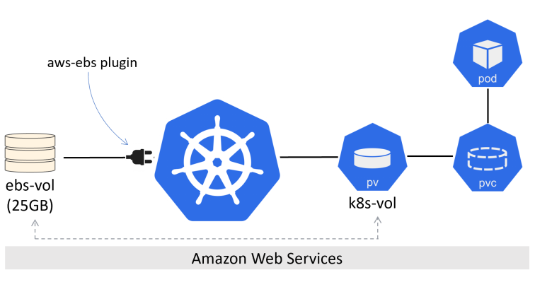

# Kubernetes Storage

## 1.  Volume, Persistent volume (PV), Persistent volume claim (PVC)

Vấn đề lưu trữ rất quan trọng với hầu hết các ứng dụng product. Kubernetes có hệ thống lưu trữ gọi là persistent volume subsystem. Tất cả lưu trữ trong cluster được gọi là volume.


Ở bên trái là các nhà cung cấp dịch vụ lưu trữ. Để trở thành storage trong trong k8s, cần phải có 1 plugin để storage provider có thể hiện dưới dạng volume trong kubernetes.

Ví dụ: 

K8s Cluster chạy trên AWS và quản trị viên AWS đã tạo 25G EBS volume gọi là "ebs-vol". K8s admin tạo PV gọi là "k8s-vol" và kết nối "ebs-vol" thông qua plugin kubernetes.io/aws-ebs. 



PV chỉ là đại diện cho 1 external storage trên cụm kubernetes, Pod sử dụng PVC để yêu cầu access vào PV. Một external storage chỉ được sử dụng bởi 1 PV.

### 1.1.  Storage Providers

Kubernetes có thể sử dụng lưu trữ từ các hệ thống bên ngoài, có thể là AWSElasticBlockStore hoặc AzureDissk, nhưng chúng cũng có thể là các storage như iSCSI, NFS. Tùy vào các lựa chọn lưu trữ nhưng điều mang lại sẽ là K8s được lưu trữ trên phạm vi rộng từ hệ thống bên ngoài. 

### 1.2.  The Kubernetes persistent volume subsystem
3 tài nguyên chính trong persistent volume subsystem là: persistent volume (PV), persistent volume claims (PVC), storage classes (SC)

VD: Ta có 1 cụm k8s và 1 hệ thống lưu trữ ngoài. Nhà cung cấp bộ nhớ ngoài cung cấp 1 plugin CSI để ta có thể truy cập và lưu trữ dữ liệu của cụm k8s. Ta cung cấp 3 x10 volume trên hệ thống lưu trữ và tạo 3 đối tượng K8s PV để cung cấp chúng trong cụm. Mỗi PV tham chiếu đến 1 volume trên hệ thống lưu trữ ngoài thông qua plugin CSI. 

Bây giờ, giả sử ta triển khai 1 ứng dụng yêu cầu 10G bộ nhớ và đã có sẵn 3 PV 10G. Để ứng dụng sử dụng 1 trong các PV, ta cần có PVC. Như đã đề cập trước đó, PVC giống như 1 ticket cho phép Pod sử dụng PV. Khi ứng dụng có PVC, nó có thể gắn PV tương ứng vào Pod dưới dạng 1 volume.

Các bước cần để triển khai pod sử dụng pv.

- Khởi tạo 1 persistent volume. PV có thể là 1 trong các kiểu nfs, glusterfs, ceph, gcePersistentDisk, awsElasticBlockStore, ... 
- Tạo 1 manifest Persistent volume claim ( PVC ) và thực hiện  ràng buộc với PV được tạo ở trước đó. Nó chỉ định dung lượng lưu trữ và kiểu lưu trữ cần thiết. 
- Sau đó người dùng tạo Pod với volume sử dụng PVC

### 1.3.  Persistent volume vs NFS

Yêu cầu: 

- 1 máy làm máy chủ nfs server, đã tiến hành share thư mục đã tạo
- Các máy worker đã được cài nfs client

VD: NFS server có ip là: 172.16.70.154 và đã tiến hành share thư mục /data/k8s/test 

#### 1.3.1.  Bước 1: Định nghĩa PV:

```
cat <<EOF >  /root/pv-nfs.yaml
apiVersion: v1
kind: PersistentVolume
metadata:
  name: my-nfs-share
  labels:
    storage: test1
spec:
  storageClassName: test
  capacity:
    storage: 5Gi # This size is used to match a volume to a tenents claim
  accessModes:
    - ReadWriteMany # Access modes are defined below
  persistentVolumeReclaimPolicy: Recycle # Reclaim policies are defined below
  nfs:
    server: 172.16.70.154
    path: "/data/k8s/test"
EOF
```

- `ReadWriteOne (RWO)` :  Xác định 1 pV chỉ có thể gắn/ràng buộc R/W với 1 PVC duy nhất. Có nhiều PVC ràng buộc, nó sẽ fail
- `ReadWriteMany (RWM)`: Xác định 1 PV có thể gắn/ràng buộc R/W với nhiều PVC. Chế độ này thường chỉ hỗ trợ bởi file và object storage như NFS. Block storage thường hỗ trợ chế độ RWO
- `ReadOnlyMany (ROM)`: Xác định 1 PV có thể gắn/ràng buộc R/O bởi nhiều PVC 

Một vài điều đáng chú ý: Đầu tiên, 1 PV chỉ có thể khởi tạo bởi 1 chế độ. Nó không hỗ trợ 1 PV có ràng buộc với PVC ở chế độ ROM và 1 PVC khác ở chế độ RWM. Thư 2, Pod không hoạt động riêng với PV mà nó luôn thực hiện thông qua PVC có ràng buộc với PV.

```
kubectl apply -f /root/pv-nfs.yaml
```
```
root@kube-master:~# kubectl get pv
NAME           CAPACITY   ACCESS MODES   RECLAIM POLICY   STATUS   CLAIM               STORAGECLASS   REASON   AGE
my-nfs-share   5Gi        RWX            Recycle          Bound    default/myapp-nfs   test                    4h11m
```

#### 1.3.2.  Bước 2: Định nghĩa PVC

```
cat <<EOF >  /root/pv-nfs-claim.yaml
apiVersion: v1
kind: PersistentVolumeClaim
metadata:
  name: myapp-nfs
  namespace: default
spec:
  storageClassName: test
  accessModes:
    - ReadWriteMany # Access modes for volumes is defined under Persistent Volumes
  resources:
    requests:
      storage: 5Gi # volume size requested
  selector:
    matchLabels:
      storage: test1
EOF
```

Khi tạo PV thì các tham số access modes, storage class, capacity phải khớp với PV. 


Note: Nếu một PVC 10G được gán vào 1 PV 15G thì vẫn có thể gán được, tuy nhiên ta sẽ lãng phí 5G. Nhưng PVC 10G không thể gán được vào PV 10G. 

```
kubectl apply -f /root/pv-nfs-claim.yaml
```
```
root@kube-master:~# kubectl get pvc
NAME        STATUS   VOLUME         CAPACITY   ACCESS MODES   STORAGECLASS   AGE
myapp-nfs   Bound    my-nfs-share   5Gi        RWX            test           4h14m
```

#### 1.3.3.  Bước 3: Tạo file deployment sử dụng pvc vừa tạo

```
cat <<EOF >  /root/deployment-nginx-pvc.yaml
apiVersion: apps/v1 # for versions before 1.9.0 use apps/v1beta2
kind: Deployment
metadata:
  name: nginx
spec:
  selector:
    matchLabels:
      app: nginx
  replicas: 3
  template: # create pods using pod definition in this template
    metadata:
      labels:
        app: nginx
    spec:
      containers:
      - image: nginx
        name: test-web
        volumeMounts:
        - mountPath: /var/www/html
          name: data
      volumes:
      - name: data
        persistentVolumeClaim:
          claimName: myapp-nfs
EOF
```
```
kubectl apply -f /root/deployment-nginx-pvc.yaml
```
```
root@kube-master:~# kubectl get pod -o wide
NAME                     READY   STATUS    RESTARTS   AGE     IP            NODE      NOMINATED NODE   READINESS GATES
nginx-555f8dc6c7-2xqdg   1/1     Running   0          3h56m   10.244.1.24   worker1   <none>           <none>
nginx-555f8dc6c7-8dmsw   1/1     Running   0          3h56m   10.244.1.23   worker1   <none>           <none>
nginx-555f8dc6c7-w8f26   1/1     Running   0          3h56m   10.244.1.25   worker1   <none>           <none>
```
#### 1.3.4.  Bước 4: Kiểm tra kết quả
Trên thư mục /data/k8s/test ở nfs server, tạo 1 file để kiểm tra:

```
touch "test volume k8s" > /data/k8s/test/volume-test.txt
```

Trên k8s master chạy các lệnh sau để kiểm tra:

```
root@kube-master:~# kubectl exec -it nginx-555f8dc6c7-2xqdg cat /var/www/html/volume-test.txt
test volume k8s
```
```
root@kube-master:~# kubectl exec -it nginx-555f8dc6c7-8dmsw cat /var/www/html/volume-test.txt
test volume k8s
```
```
root@kube-master:~# kubectl exec -it nginx-555f8dc6c7-w8f26 cat /var/www/html/volume-test.txt
test volume k8s
```
## 2.  Storage Classes và Dynamic Provisioning

Tất cả mọi thứ trước đó là cơ bản về lưu trữ trong K8s. Nhưng nó không scale, không thể là phương án cho 1 môi trường Kubernetes lớn cần tự tạo và duy trì số lượng lớn PV và PVC. Ta cần cái gì đó động hơn như tự động cung cấp PV.

Đó là ta sử dụng storage classes.

Storage classes cho phép xác định các classes khác nhau hoặc các tầng lưu trữ khác nhau. Các ta xác định các classes là tùy thuộc vào mình nhưng sẽ phụ thuộc vào loại lưu trữ mà ta có quyền truyc cập. Ví dụ ta có thể xác định 1 class với tốc độ lưu trữ nhanh, 1 class với tốc độ lưu trữ chậm, 1 class được mã hóa ( hệ thống lưu trữ bên ngoài sẽ cần hỗ trợ tốc độ lưu trữ khác nhau và hỗ trợ mã hóa volume vì Kubernetes không làm điều này).

Theo Kubernetes, các storage classes được định nghĩa là tài nguyên trong storage.k8s.io/v1 API group. Loại tài nguyên (resource type) là StorageClass, và ta sẽ định nghĩa trong các file YAML thông thường mà ta POST lên API để deployment. Ta có thể sử dụng tên viết tắt sc để tham chiếu đến các đối tượng StorageClass khi sử dụng kubectl.

Ta có thể liệt kê danh sách các resource APi bằng cách sử dụng lệnh kubectl api-resources

Khi tạo 1 StorageClass để giúp ta tự động tạo PV. Khi tạo 1 PVCs, ta sẽ chỉ định storageClassName, lúc này PVCs sẽ request tới StorageClass và StorageClass sẽ tự động tạo PV cho PVCs dùng.

### 2.1.  Cấu hình Storage Classes provisioner

Yêu cầu: 

- 1 máy làm máy chủ nfs server, đã tiến hành share thư mục đã tạo
- Các máy worker đã được cài nfs client

VD: NFS server có ip là: 192.168.1.131 và đã tiến hành share thư mục /mnt/k8s/nfs_share

Trên Kubernetes master thực hiện lần lượt các bước sau:

Tạo file rbac.yaml để cấu hình service acount, nó sẽ tạo Role, RoleBinding, và các role khác nhau trong cụm kubernetes.

```
kind: ServiceAccount
apiVersion: v1
metadata:
  name: nfs-client-provisioner
  namespace: default
---
kind: ClusterRole # Role of kubernetes
apiVersion: rbac.authorization.k8s.io/v1 # auth API
metadata:
  name: nfs-client-provisioner-runner
rules:
  - apiGroups: [""] # rules on persistentvolumes
    resources: ["persistentvolumes"]
    verbs: ["get", "list", "watch", "create", "delete"]
  - apiGroups: [""]
    resources: ["persistentvolumeclaims"]
    verbs: ["get", "list", "watch", "update"]
  - apiGroups: ["storage.k8s.io"]
    resources: ["storageclasses"]
    verbs: ["get", "list", "watch"]
  - apiGroups: [""]
    resources: ["events"]
    verbs: ["create", "update", "patch"]
---
kind: ClusterRoleBinding
apiVersion: rbac.authorization.k8s.io/v1
metadata:
  name: run-nfs-client-provisioner
subjects:
  - kind: ServiceAccount
    name: nfs-client-provisioner # defined on top of file
    namespace: default
roleRef: # binding cluster role to service account
  kind: ClusterRole
  name: nfs-client-provisioner-runner # name defined in clusterRole
  apiGroup: rbac.authorization.k8s.io
---
kind: Role
apiVersion: rbac.authorization.k8s.io/v1
metadata:
  name: leader-locking-nfs-client-provisioner
  namespace: default
rules:
  - apiGroups: [""]
    resources: ["endpoints"]
    verbs: ["get", "list", "watch", "create", "update", "patch"]
---
kind: RoleBinding
apiVersion: rbac.authorization.k8s.io/v1
metadata:
  name: leader-locking-nfs-client-provisioner
subjects:
  - kind: ServiceAccount
    name: nfs-client-provisioner # same as top of the file
    # replace with namespace where provisioner is deployed
    namespace: default
roleRef:
  kind: Role
  name: leader-locking-nfs-client-provisioner
  apiGroup: rbac.authorization.k8s.io
```

Triển khai service account:

```
kubectl apply -f rbac.yaml
```

Tạo file nfs_class.yaml để khai báo 1 storage class:

```
apiVersion: storage.k8s.io/v1
kind: StorageClass
metadata:
  name: managed-nfs-storage # IMPORTANT pvc needs to mention this name
provisioner: fuseim.pri/ifs # name can be anything
parameters:
  archiveOnDelete: "false"
```

Áp dụng file Storageclass:

```
kubectl create -f nfs_class.yaml
```
Kiểm tra:

```
root@kube-master:~# kubectl get sc
NAME                  PROVISIONER      RECLAIMPOLICY   VOLUMEBINDINGMODE   ALLOWVOLUMEEXPANSION   AGE
managed-nfs-storage   fuseim.pri/ifs   Delete          Immediate           false                  18h
```

Tạo file nfs_pod_provision.yaml để thêm thông tin nfs client provisioner thành 1 pod.

```
kind: Deployment
apiVersion: apps/v1
metadata:
  name: nfs-client-provisioner
  labels:
    app: nfs-client-provisioner
  namespace: default
spec:
  replicas: 1
  strategy:
    type: Recreate
  selector:
    matchLabels:
      app: nfs-client-provisioner
  template:
    metadata:
      labels:
        app: nfs-client-provisioner
    spec:
      serviceAccountName: nfs-client-provisioner # name of service account created in rbac.yaml
      containers:
        - name: nfs-client-provisioner
          image: quay.io/external_storage/nfs-client-provisioner:latest
          volumeMounts:
            - name: nfs-client-root
              mountPath: /persistentvolumes
          env:
            - name: PROVISIONER_NAME # do not change
              value: fuseim.pri/ifs # SAME AS PROVISONER NAME VALUE IN STORAGECLASS
            - name: NFS_SERVER # do not change
              value: 192.168.1.131 # Ip of the NFS SERVER
            - name: NFS_PATH # do not change
              value: /mnt/k8s/nfs_share # path to nfs directory setup
      volumes:
       - name: nfs-client-root # same as volumemouts name
         nfs:
           server: 192.168.1.131
           path: /mnt/k8s/nfs_share
```

Triển khai pod:

```
kubectl apply -f nfs_pod_provision.yaml
```

Tạo file nfs_pvc_dynamic.yaml để kiểm tra việc gắn 1 pvc vào storageclass đồng thời kiểm tra cài đặt nfs stoageclass provisioner đã thành công hay chưa:

```
kind: PersistentVolumeClaim
apiVersion: v1
metadata:
  name: jenkins-claim
  annotations:
    volume.beta.kubernetes.io/storage-class: "managed-nfs-storage"
spec:
  accessModes:
    - ReadWriteMany
  resources:
    requests:
      storage: 5Gi
```

Triển khai PVC:

```
kubectl apply -f  nfs_pvc_dynamic.yaml
```

```
root@kube-master:~# kubectl get pvc
NAME            STATUS   VOLUME                                     CAPACITY   ACCESS MODES   STORAGECLASS          AGE
jenkins-claim   Bound    pvc-2c05f713-45f3-434a-a02e-8c92023e39bd   5Gi        RWX            managed-nfs-storage   18h
```

Như vậy, việc triển khai dynamic nfs provisioning đã thành công.

> Nhược điểm của việc lưu trữ bằng NFS là việc cấp dung lượng cho PVC chỉ để trưng bày, không có tác dụng giới hạn dung lượng.