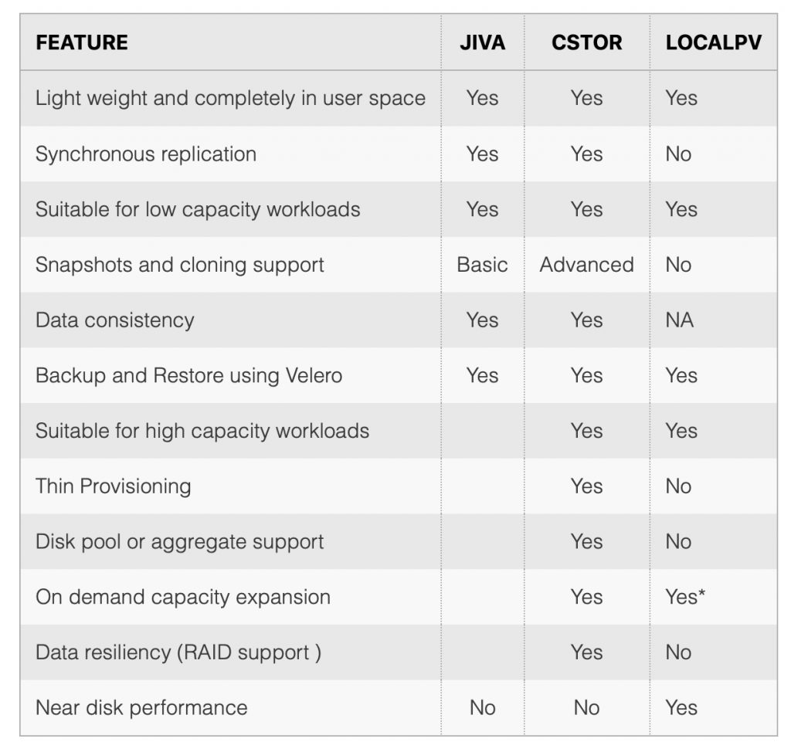
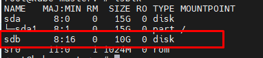

# Lưu trữ trong K8s sử dụng OpenEBS

OpenEBS là một dự án lưu trữ được tạo bởi MayaData, xây dựng trên 1 cụm Kubernetes. OpenEBS chạy trên bất kỳ nền tảng kubernetes nào và sử dụng bất kỳ giải pháp lưu trữ cloud nào bao gồm AWS s3, GKE, AKS.

OpenEBS có các thành phần sau:

- [Data plane components](https://openebs.io/docs/#DataPlane) – cStor, Jiva and LocalPV

Data plane chịu trách nhiệm về IO path của persistent volume. Có thể lựa chọn một trong 3 công cụ lưu trữ tùy vào sở thích hoặc ý đồ lưu trữ của bạn.

1. **cStor** - Cung cấp các tính năng cấp doanh nghiệp như snapshot, clones, thin provisioning, data consistency và scalability.

2. **Jiva** - 

3. **LocalPV** - 



## Cấu hình OpenEBS trên Kubernetes Cluster

- Chuẩn bị: Trên các node workder phải có ít nhất một ổ đĩa gắn ngoài chưa được mount vào folder nào. 



- K8s cluster version `> 1.17`

### Cài đặt OpenEBS trên kubernetes sử dụng cStor (ubuntu 18.04)

Cài đặt iscsid trên các node worker:

```
sudo apt-get update
sudo apt-get install open-iscsi
sudo systemctl enable --now iscsid
systemctl status iscsid
```

- Clone repo cstor 

```
git clone https://github.com/openebs/cstor-operators.git
```

- Cài đặt openebs với cStor

```
cd cstor-operators
kubectl create -f deploy/yamls/rbac.yaml
kubectl create -f deploy/yamls/ndm-operator.yaml
kubectl create -f deploy/crds
kubectl create -f deploy/yamls/cspc-operator.yaml
kubectl create -f deploy/yamls/csi-operator.yaml
```

- Kiểm tra các pod đã cài đặt

```
root@kube-master:~# kubectl get pod -n openebs
NAME                                                              READY   STATUS    RESTARTS   AGE
cspc-operator-666f6565-p9278                                      1/1     Running   0          173m
cstor-storage-m6zn-776696fc74-tndsd                               3/3     Running   0          169m
cvc-operator-65587c87bf-dl9nm                                     1/1     Running   0          173m
openebs-cstor-admission-server-5965477d69-x7g28                   1/1     Running   0          173m
openebs-cstor-csi-controller-0                                    6/6     Running   0          173m
openebs-cstor-csi-node-25dpk                                      2/2     Running   0          173m
openebs-localpv-provisioner-d96849fd5-cnzzg                       1/1     Running   0          3h14m
openebs-ndm-cluster-exporter-68845479ff-q6rj7                     1/1     Running   0          3h14m
openebs-ndm-lj96t                                                 1/1     Running   0          3h14m
openebs-ndm-node-exporter-ljqkl                                   1/1     Running   0          3h14m
openebs-ndm-operator-7dc87bcfdc-h526q                             1/1     Running   0          3h14m
pvc-33580dbd-86c8-4a13-a6e8-6f5bab6be114-target-cc8876477-44zq6   3/3     Running   0          137m
```

- Kiểm tra blockdevice

```
root@kube-master:~# kubectl get bd -n openebs
NAME                                           NODENAME   SIZE          CLAIMSTATE   STATUS   AGE
blockdevice-47e4e0a901e2ca1874ee5ae952cd6873   worker1    10736352768   Claimed      Active   3h25m
```

- Triển khai cStor poll theo yaml sau:

`cstor-pool-config.yaml`

```
apiVersion: cstor.openebs.io/v1
kind: CStorPoolCluster
metadata:
  name: cstor-storage
  namespace: openebs
spec:
  pools:
    - nodeSelector:
        kubernetes.io/hostname: "worker1"
      dataRaidGroups:
        - blockDevices:
            - blockDeviceName: "blockdevice-47e4e0a901e2ca1874ee5ae952cd6873"
      poolConfig:
        dataRaidGroupType: "stripe"
```

```
kubectl apply -f cstor-pool-config.yaml
```

- Kiểm tra cStorPoolCluster

```
root@kube-master:~# kubectl get cspc -n openebs
NAME            HEALTHYINSTANCES   PROVISIONEDINSTANCES   DESIREDINSTANCES   AGE
cstor-storage   1                  1                      1                  173m
```

```
root@kube-master:~# kubectl get cspi -n openebs
NAME                 HOSTNAME   FREE    CAPACITY   READONLY   PROVISIONEDREPLICAS   HEALTHYREPLICAS   STATUS   AGE
cstor-storage-m6zn   worker1    9630M   9630238k   false      1                     1                 ONLINE   174m
```

- Tạo storageclass

`csi-cstor-sc.yaml`

```
kind: StorageClass
apiVersion: storage.k8s.io/v1
metadata:
  name: cstor-csi
provisioner: cstor.csi.openebs.io
allowVolumeExpansion: true
parameters:
  cas-type: cstor
  # cstorPoolCluster should have the name of the CSPC
  cstorPoolCluster: cstor-storage
  # replicaCount should be <= no. of CSPI
  replicaCount: "3"
```

>Lưu ý: Nên đặt replicaCount = với số lượng blockdevice

```
kubectl apply -f csi-cstor-sc.yaml
```

- Tạo pvc

`test-pvc.yaml`

```
kind: PersistentVolumeClaim
apiVersion: v1
metadata:
  name: demo-cstor-vol
spec:
  storageClassName: cstor-csi
  accessModes:
    - ReadWriteOnce
  resources:
    requests:
      storage: 2Mi
```

```
kubectl apply -f test-pvc.yaml
```

### Kiểm tra

```
root@kube-master:~# kubectl get pvc
NAME             STATUS   VOLUME                                     CAPACITY   ACCESS MODES   STORAGECLASS   AGE
demo-cstor-vol   Bound    pvc-33580dbd-86c8-4a13-a6e8-6f5bab6be114   2Mi        RWO            cstor-csi      3h37m
```


```
root@kube-master:~# kubectl get cstorvolumeconfig -n openebs
NAME                                       CAPACITY   STATUS   AGE
pvc-33580dbd-86c8-4a13-a6e8-6f5bab6be114   1Gi        Bound    3h39m
```

```
root@kube-master:~# kubectl get cstorvolume -n openebs
NAME                                       CAPACITY   STATUS    AGE
pvc-33580dbd-86c8-4a13-a6e8-6f5bab6be114   1Gi        Healthy   3h39m
```

```
root@kube-master:~# kubectl get cstorvolumereplica -n openebs
NAME                                                          ALLOCATED   USED   STATUS    AGE
pvc-33580dbd-86c8-4a13-a6e8-6f5bab6be114-cstor-storage-m6zn   6K          6K     Healthy   3h39m
```


